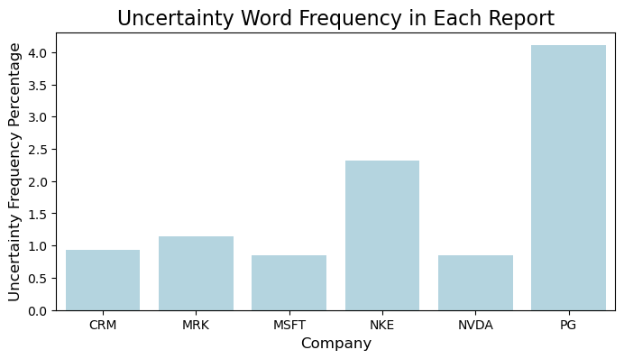
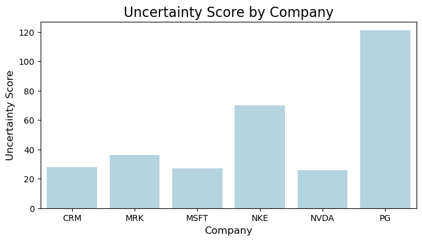

By Group "Language Magician"

## 1. Abstract 
 Our project aims to study the relationship between the companies'stock return and the hedging words frequencies as the textual precision information in their annual reports. Thus, this blog introduces our explorations on the NLP processing methods and improvements we made to derive the hedging words frequencies, from data collection to text processing.
 
 Considering the practicability, our text research focuses on the **"Business"**, **"Risk Factors"**, and **Management's Discussion and Analysis of Financial Condition and Results of Operations"** sections of the annual reports of Dow Jones components from 2020 to 2022. The data source is the 10-K filings on the [SEC website](https://www.sec.gov/). 

## 2. Text Data Collection
###  2.1 Basic Method
Initially, we adopted the approach of requesting text data from the SEC website and processing it using regular expressions. The steps are as follows:
#### Step1: Identifying target companies and obtaining CIK identifiers
We obtained the CIKs of the DOW30 from a specific file to lay the foundation for subsequent operations.
```python
DJIA_TICKERS = ["MMM", "AXP", ..., "WMT"]
HEADERS = {'User-Agent': "example@example.com"}
def get_cik_mapping():
    cik_data = requests.get(SEC_JSON_URL).json()
    return {
        v['ticker']: str(v['cik_str']).zfill(10)
        for v in cik_data.values()
        if v['ticker'] in DJIA_TICKERS
    }
```
#### Step 2: Annual report data screening
Based on the CIKs, we accessed the submissions interface of the SEC website to obtain the company's filing data and filtered out the 10-K annual reports from 2020 to 2022.
```python
filings = pd.DataFrame(submissions['filings']['recent'])
filings = filings[
    (filings['form'] == '10-K') & 
    (filings['reportDate'].dt.year.between(2020, 2022))
]
```
#### Step3:  Extracting the three sections "Business", "Risk Factors", and "Management’s Discussion” from the annual reports
We defined a text cleaning function to remove HTML tags, merge white spaces, and clean special characters. We used carefully written regular expressions to precisely extract the corresponding section content according to the Item numbers.

```python
def extract_section(text, item_pattern):
    start_pattern = re.compile(
        rf'Item\s*{item_pattern}.*?(?=\n)', 
        re.IGNORECASE
    )
    end_pattern = re.compile(
        r'(Item\s*\d+|PART\s*[IVX]+)', 
        re.IGNORECASE
    )
    # After matching the start position, intercept until the next Item or PART
```
#### Step 4: Data saving
Then, we saved the extracted content of Item 1, 1A, and 7 as text files for subsequent analysis. The code for this part is relatively simple and is omitted here.

### 2.2 A Technical Problem and Improvements
Although the above method has a simple logic, it leads to a technical problem that the CIK identifiers cannot recognize all annual reports. This is likely due to issues such as data acquisition being affected by network problems, anti - crawling mechanisms, and the regular expressions being prone to matching failures due to changes in title formats or the presence of special characters. 
Meanwhile, we tried another method to introduce multi - threading to improve the download efficiency and using BeautifulSoup to parse HTML, but there were still problems with text parsing.

Finally, after the explorations, we moved to applying the [Edgartools library](https://github.com/dgunning/edgartools). Edgartools can identify these titles and numbers in the report, extract the corresponding content, and store it in the attributes of Python objects. Thus, we can directly access the content of these sections through the attribute names and collect the required sections in the annual reports. 

The revised steps are as follows:
#### Step 1: Configuration and data acquisition: 
We set the access information, which can identify these titles and numbers in the report, defined the company list and year range, and used the Company class and an asynchronous function to obtain the 10-K annual reports of companies and extract the content of Item 1, 1A, and 7.
```python
set_identity('example@example.com')
COMPANY_LIST = ["MMM", "AXP", "AMGN", ..., "WMT"]
YEAR_START = 2020
YEAR_END = 2023
async def fetch_company_data(ticker: str, year: int):
    com = Company(ticker)
    com_file = com.get_filings(form="10-K").latest(5)
    com_2 = com_file[2024 - year].obj()
    item1 = com_2['Item 1']
    item1a = com_2['Item 1A']
    item7 = com_2['Item 7']
    return f"{item1} {item1a} {item7}"
```
#### Step 2: Data integration and saving
In the main function, we created a task list and used asyncio.gather to execute tasks concurrently. Then we organized the results into a DataFrame and saved it as an Excel file.
```python
async def main():
    tasks = []
    
    for ticker in COMPANY_LIST:
        for year in range(YEAR_START, YEAR_END):
            tasks.append(fetch_company_data(ticker, year))

    results = await asyncio.gather(*tasks)

    data_list = [
        (
            COMPANY_LIST[i // (YEAR_END - YEAR_START)], 
            YEAR_START + (i % (YEAR_END - YEAR_START)), 
            results[i]
        )
        for i in range(len(results))
    ]

    df = pd.DataFrame(data_list, columns=['Company', 'Year', 'Annual_Report(Item1_1A_7)'])
    df.to_excel('output2.xlsx', index=False)

if __name__ == "__main__":
    asyncio.run(main())
```
The revised method significantly improved the recognition rate of the target paragraphs. However, there is one flaw. During the processing, we found that the annual reports of three companies (such as HON) do not follow the regular structure, resulting in the inability to effectively recognize the "Business", "Risk Factors", and "Management’s Discussion and Analysis of Financial Condition and Results of Operations" sections of 3 companies. Next, we will further optimize the keyword recognition method. Given that the number of companies that cannot be effectively recognized is small, if we still cannot fully recognize them, we will manually extract the corresponding content from the annual reports of these companies. 

## 3. Text Processing
This section aims to verify the feasibility of the following text processing techniques. We first use a testing sample containing the 2022 annual reports of six companies, and the analysis on three-year 30-companies will be launched later.
#### Step1. Removed punctuation, stop words, and converted all words to lowercase.
After extracting the text, we need to preprocess the text to for further analysis. 
First, we removed punctuation, stop words, and converted all words to lowercase. 
```python
def preprocess_text(text):
    text = text.translate(str.maketrans('', '', string.punctuation))
    words = word_tokenize(text.lower())
    stop_words = set(stopwords.words('english'))
    filtered_words = [word for word in words if word not in stop_words]
    return ' '.join(filtered_words)
```

#### Step2. Lemmatization and Uncertainty Word Analysis
 Then, we apply lemmatization, reducing words to their base forms using the spaCy library. The following code snippet performs lemmatization:
```python
nlp = spacy.load("en_core_web_sm")
lemmatized_text = " ".join([token.lemma_ for token in nlp(text)])
```
This code loads the English model from spaCy and lemmatizes the text. The token.lemma_ attribute returns the base form of each word, which helps us match words more accurately in subsequent analysis.

#### Step3. Calculate the frequency of uncertaity words.
Next, we calculate the frequency of uncertainty-related words using a predefined dictionary. 
```python
def uncertainty_score(text):
    uncertain_word_count = 0
    tokens = text.split()
    for word in tokens:
        if word in uncertain_dictionary:
            uncertain_word_count += 1
    return uncertain_word_count
```


#### Step4. Data Visualization
Finally, we use matplotlib and seaborn to visualize the analysis results to intuitively display the uncertaity score and frequency of uncertainty words in different company reports.
```python
import matplotlib.pyplot as plt
import seaborn as sns

# Frequency plot
plt.figure(figsize=(8, 4))

sns.barplot(
    x='company', 
    y='Uncertainty_Frequency_Percentage', 
    data=df, 
    color='lightblue'
)

plt.title('Uncertainty Word Frequency in Each Report', fontsize=16)
plt.xlabel('Company', fontsize=12)
plt.ylabel('Uncertainty Frequency Percentage', fontsize=12)

plt.show()
```

```python
# Uncertainty score calculation
company_uncertainty_scores = df.groupby('company')['uncertainty_score'].mean()

# Plot the uncertainty score for each company
plt.figure(figsize=(8, 4))

sns.barplot(
    x=company_uncertainty_scores.index, 
    y=company_uncertainty_scores.values, 
    color='lightblue'
)

plt.title('Uncertainty Score by Company', fontsize=16)
plt.xlabel('Company', fontsize=12)
plt.ylabel('Uncertainty Score', fontsize=12)

plt.show()
```


## 4. The Phased Objectives
Through the above explorations on data processing, we choose a way to crawl the specific paragraphs in the multi-year annual reports. Then, we exact the hedging word frequency and visualize the hedging information with a testing sample. 
Later, our project will further complete the full sample text processing and obtain the stock return after 30, 90, and 252 days after the respective report releasing date, and then launch the correlation analysis. 