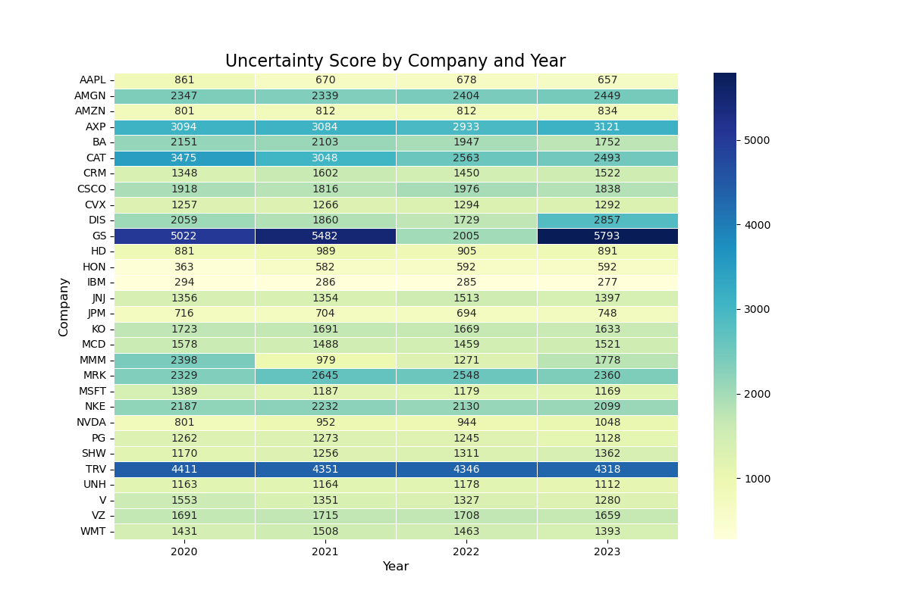
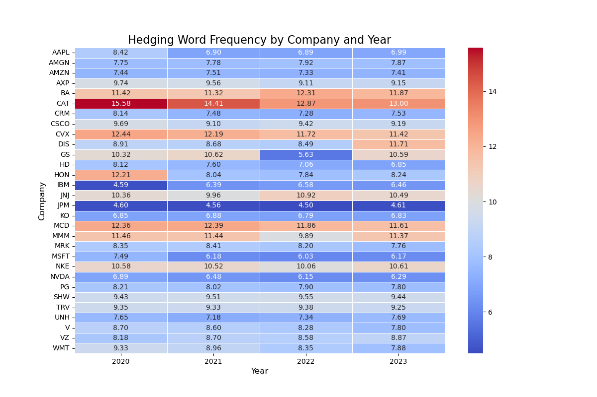
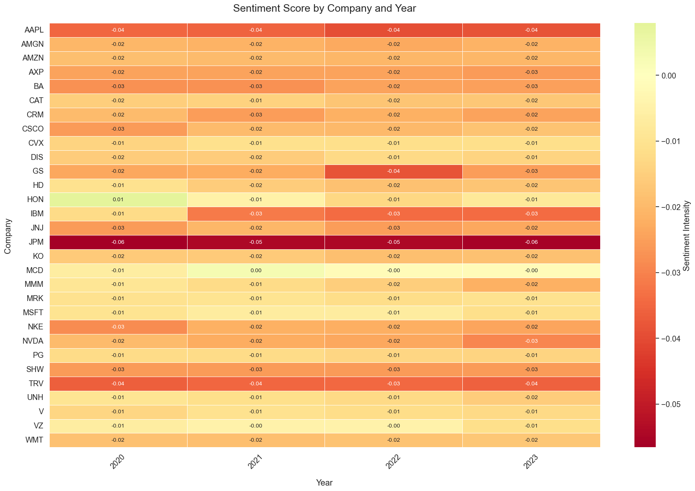
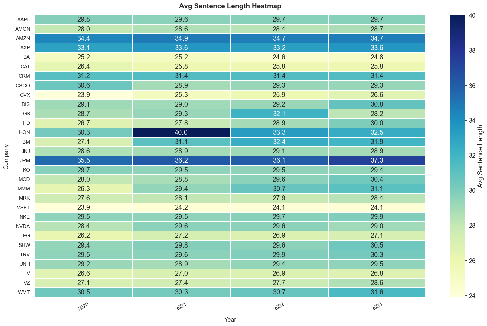
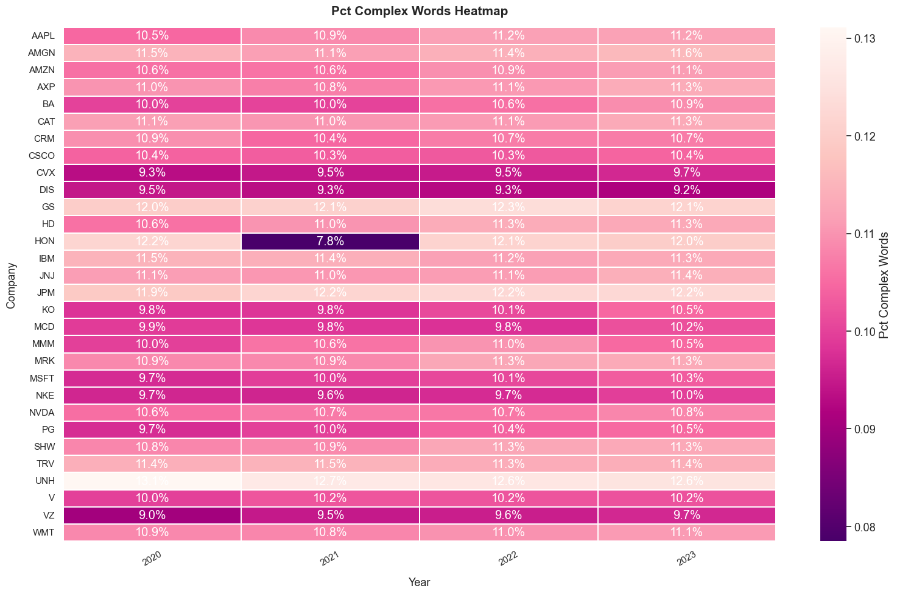
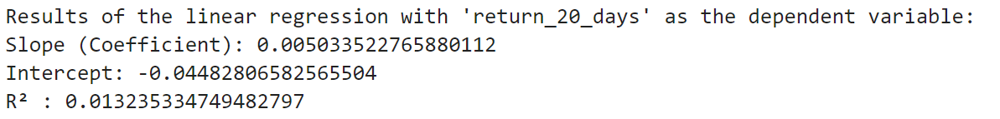
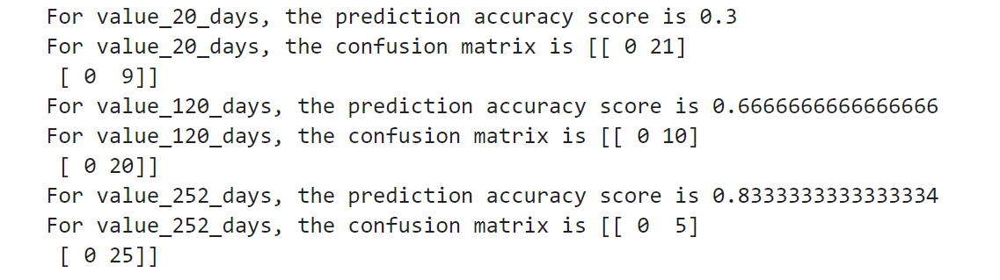
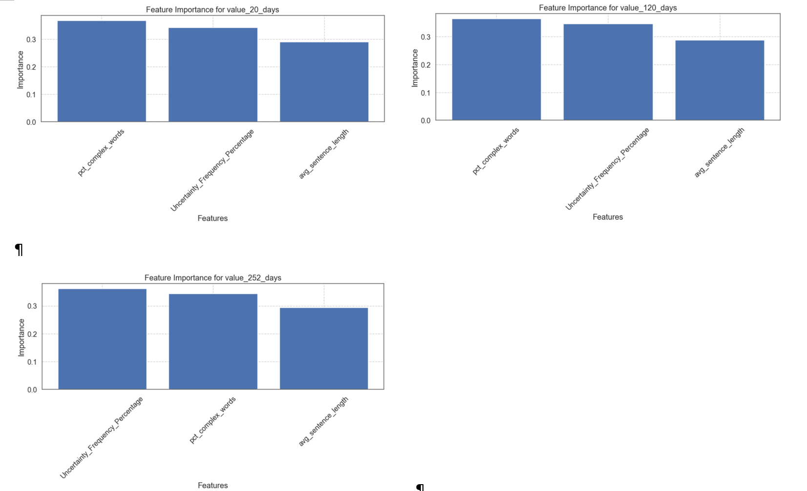
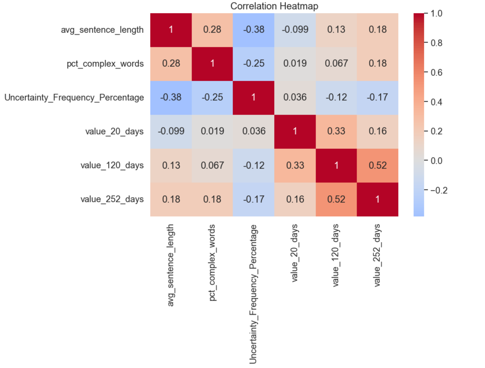

By Group "Language Magician"
## 1. Introduction
 Our project aims to study the relationship between the companies' stock performance and the hedging words frequencies as the textual precision information in their annual reports. Thus, this blog introduces our explorations on the NLP processing methods and improvements we made to derive the ambiguous of annual report, collect stock performance, and show the progress of regression and machine learning when we study the relationship of the language ambiguity of company annual reports and their stock returns.
 
 The main sections of this blog would be: 1. Further NLP of Annual Report; 2. Data Collection and Processing of Stock Price, 3. Regression based on data collected and 4. Supervised Machine Learning, please see later blog.

## 2. Annual Report Data Collection and NLP
###  2.1 Annual Report Collection
 In the last Blog, we have mentioned that the annual reports of four companies (such as HON) do not follow the regular structure, resulting in the inability to effectively recognize the "Business", "Risk Factors", and "Management's Discussion and Analysis of Financial Condition and Results of Operations" sections. Thus, we use an alternative way to get the textual data of the three section of the annual report of these four companies from their pdf version of annual report. And we use library [pdfplumber](https://github.com/jsvine/pdfplumber) to get the textual data from the annual report, and add it manually to the csv document we needed for later analysis.

#### Using pdfplumber to get the textual data from pdf version of annual report

```python
 import pdfplumber
 txtpath = r"Annual_Report.txt"
 pdfpath = r"Annual_Report.pdf"
 with open(txtpath,"w",encoding='utf-8') as txt:  # create the txt file
    with pdfplumber.open(pdfpath) as pdf:  # open the pdf file
        for page in pdf.pages:
            txt.write(page.extract_text())
```
 
### 2.2 Dealing with Annual Report of 30 companies in 4 years (2020-2023)
 To deal with other companies, we apply the library [edgartools](https://github.com/dgunning/edgartools). Besides, we also get the release date of those annual reports, which would be essential for our collection of stock price on the annual report release date, after 20 trading days, 120 trading days and 252 trading days.
#### Step 1: Collection in Annual Report filing date: 
 Here we get the filing date of the annual reports and store it in the csv document for future stock price collection. And to improve the efficiency of computation in getting data, we use library [asyncio](https://docs.python.org/zh-cn/3.12/library/asyncio.html) to assist the process. 

```python
 from edgar import Company, set_identity
 import asyncio
 set_identity('example@example.com')
 COMPANY_LIST = ["MMM", "AXP", "AMGN", ..., "WMT"]
 YEAR_START = 2020
 YEAR_END = 2023
 async def fetch_company_data(ticker: str, year: int):
    try:
        com = Company(ticker)
        com_file = com.get_filings(form="10-K").latest(5)
        com_2 = com_file[2024 - year].obj()

        # Get Required Section of Annual Report
        item1 = com_2['Item 1']
        item1a = com_2['Item 1A']
        item7 = com_2['Item 7']

        # Get the filing date
        if 2024 - year < len(com_file):
            filing_date = com_file[2024 - year].filing_date
        else:
            None
        return item1, item1a, item7, filing_date

     except (IndexError, KeyError, AttributeError) as e:
        print(f"Error fetching data for {ticker} in {year}: {e}")
        return "", "", "", None
```

#### Step 2: Collect one more year of Annual reports as the testing dataset
 Based on our research progress, we decided to train a model that learn from the relationship between the hedging word frequency and stock performance. Thus, we also collect the most recent information as the testing set to see the accuracy of our trained model. And for data storage, we use library [pandas](https://pandas.pydata.org) for assistance.
 
```python
 # ...(same code as blog 1)
 # Here are the main improvements
 import pandas as pd
  data_list = [
    (
        COMPANY_LIST[i // (YEAR_END - YEAR_START + 1)], 
        YEAR_START + (i % (YEAR_END - YEAR_START + 1)), 
        results[i]
        )
        for i in range(len(results))
     ]

     # Create a DataFrame and save to CSV
     df = pd.DataFrame(
        data_list, 
        columns=\
            ['Company', 'Year', 'Item 1', 'Item 1A', 'Item 7', 'Filing Date']
        )
     df.to_csv('first_version_annual_reports.csv', index=False)
     print("Data has been written to first_version_annual_reports.csv")

```

###  2.3 Ambiguity Statistics for 30 companies annual report over the four year period (2020-2023)
 After Blog 1 trail in dealing with sample set of the annual reports and processing the hedging word frequency, we improve our programming and apply it to all 30 company's report over the recent four year period. Besides, we also add more valuing criteria such as the sentiment score, complexity of sentences and words to evaluate the ambiguitiness of Annual Report. And below are the major improvements after Blog 1 coding.
#### Improvement 1: Use all 30 company's four-year annual report
 As we have get more data in companies' annual report, in the data visualization, we would apply a bigger dataset. And to get data from the previous document we saved, we use library [pandas](https://pandas.pydata.org).
 
```python
 # Get data from csv document generated in previous steps
 import pandas as pd
 df= pd.read_csv("full_version_annual_reports.csv")
 df['combined_text'] = df['Item 1'].astype('string')\
                        + df['Item 1A'].astype('string')\
                        + df['Item 7'].astype('string')

 # Get rid of NaNs                       
 df.dropna(subset=['combined_text'], inplace=True)
 txt = df['combined_text'].astype('string')
```

#### Imporvement 2: Data Visualization of Hedging Word Frequency (Using Heatmap)
 Instead of using the bar chart as in Blog 1, here we use the heatmap to better illustrate and compare the Hedging Word Frequency in different companies annual report and their changes across different years. To generate heatmap, we use the library [matplotlib](https://matplotlib.org). And we will show the heatmap result based on (1) absolute counts of hedging words (Uncertainty Score), and (2) percentage frequency of hedging words (Hedging Word Frequency):
 
```python
 # Get data from previous processed excel
 df = df.sort_values(['company', 'year'])
 df_grouped = df.groupby(['company', 'year']).agg({
    'Uncertainty_Frequency_Percentage': 'mean',
    'uncertainty_score': 'mean'
    }).reset_index()
```

##### 1. Heatmap of Uncertainty Score
 After we collect the data of Uncertainty Score, we apply the blow code to visualize the Uncertainty Score of different companies across four years: 
 
```python
 # Create a heatmap of the Uncertainty Score by company and year
 import matplotlib.pyplot as plt
 pivot_table = df_grouped.pivot(
    index='company',
    columns='year',
    values='uncertainty_score'
    )
 plt.figure(figsize=(12, 8))
 sns.heatmap(
    pivot_table,
    annot=True,
    cmap='YlGnBu', 
    linewidths=0.5,
    fmt=".0f"  
    )
 plt.title('Uncertainty Score by Company and Year', fontsize=16)
 plt.xlabel('Year', fontsize=12)
 plt.ylabel('Company', fontsize=12)
 plt.show()
```


 
##### 2. Heatmap of Hedging Word Frequency
 Then, we collect the data of Hedging Word Frequency. And we apply the code similar to above code to visualize the Hedging Word Frequency of different companies across four years: 
 


#### Imporvement 3: Data Visualization of Sentiment Score and Complexity of Sentences and Words (Using Heatmap)
 Besides the Hedging Word Frequency we have used in Blog1, our group also would like to consider other ambiguity features in the Annual Report. We consider the three factors: (1) the Sentiment Score, (2) The complexity of Sentencies, (3) The complexity of words. And besides library [matplotlib](https://matplotlib.org), here we also use library [seaborn](https://seaborn.pydata.org) to assist the drawing of Heatmap.
##### 1. Heatmap of Sentiment Score
 For the Sentiment Score, we count the frequency ofthe positive words and negative words in the previous dictionary we use. And below is the heatmap from the data analysis.
 
```python
 # Get Sentiment Score
 def financial_sentiment(text):
    tokens = text.lower().split()
    total_words = len(tokens)
    
    pos_count = len([word for word in tokens if word in positive_words])
    neg_count = len([word for word in tokens if word in negative_words])

    return (pos_count - neg_count) / total_words

 # Create a heatmap of the sentiment score by company and year
 import seaborn as sns
 pivot_df = df.pivot_table(
    index='Company',
    columns='Year',
    values='sentiment_score',
    aggfunc='mean'  
 )

 plt.figure(figsize=(18, 12))
 sns.set(font_scale=1.2)

 heatmap = sns.heatmap(
    pivot_df,
    annot=True,  
    fmt=".2f",   
    cmap="RdYlGn",  
    center=0,     
    linewidths=0.5,
    annot_kws={"size": 10},
    cbar_kws={'label': 'Sentiment Intensity'}
 )

 plt.title("Sentiment Score by Company and Year", pad=20, fontsize=18)
 plt.xlabel("Year", labelpad=15)
 plt.ylabel("Company", labelpad=15)
 plt.xticks(rotation=45)
 plt.tight_layout()
 plt.show()
```


 Here we can see that the Sentiment Scores for different companies are almost zero, which means that there is no much difference in the sentiment score for different companies in different years. And after discussion, out group decide not to include the sentiment score in our later machine learning.

##### 2. Heatmap of Sentence Complexity (Length of Sentence)
 For the Complexity of Sentence, we use the length of the Sentence as reference. And below is the heatmap from the data analysis. And for detailed calculation in python, you can see the code for report as reference. For Heatmap generattion, it is similar to previous code.
 
 

##### 3. Heatmap of Word Complexity (Syllables of Sentence)
 For the Complexity of Word, we use the Syllables that a word has as reference. The more syllables a word has, the more complexity the word would be. And below is the heatmap from the data analysis.

 

## 3. Stock Price Collection
 In this section, we will explain and illustrate how our group get the stock price of the related companies on their annual report release date, after 20/120/252 trading days. To collect the adjusted closing stock price on Yahoo Finance, we use the library [yfinance](https://pypi.org/project/yfinance/).  And we use library [numpy](https://numpy.org) to assist with the data processing. And we will discuss the difficulties we encountered and how we solve it. 
### 3.1 Initial Version of Stock Price Collection
#### Step 1. Get the Company Name and Dates
 To get the adjusted closing stock price, we first get the company name and annual report release time from the previous steps. And we created an empty list to store the closing price we are going to get.

```python
 import pandas as pd
 import yfinance as yf
 import numpy as np
 # Read Excel file
 df = pd.read_excel(file_path)
 file_path = 'full_version_annual_reports.csv'
 # the ticker simbol column is 'Company'，date column is 'Filing_Date'
 tickers = df['Company'].tolist()
 dates = pd.to_datetime(df['Filing Date']).tolist()
 # store the stock close price data
 close_prices = []
```

#### Step 2. Get the stock price on Annual Report Release Date
  After we get the Company Names and Annual Report Release Dates, we tried to get the closing stock price of the specified company on their annual report release date.
 
```python
 for ticker, date in zip(tickers, dates):
    try:
        # get price data from Yahoo Finance, from start date:
        stock = yf.Ticker(ticker)
        data = stock.history(start=date)
        
        # find the 1st recorded date
        first_valid_date = data.index.min()
        row = {
            'Company': ticker,
            'date': date
            }
            # get the stock price of the first day
        try:
            close_price = data.loc[first_valid_date, 'Close']
            row['close_price'] = close_price
        except KeyError:
            row['close_price'] = np.nan
            print(f"Didn't find {ticker} on {first_valid_date} 's price。")
        close_prices.append(row)
```

#### Step 3. Get the stock price 20, 120, 252 trading days after the Annual Report Release Date
 Then we add 20 (or 120 or 252) trading days to the release dates, and try to get the closing stock price of the specified company on those dates. Here we use 20 trading days as example, for 120 and 252 trading days, we only need to change the n accordingly. 

```python
 for ticker, date in zip(tickers, dates):
    try:
        # get price data from Yahoo Finance, from start date:
        stock = yf.Ticker(ticker)
        data = stock.history(start=date)
        
        # find the 1st recorded date
        first_valid_date = data.index.min()
        row = {
            'Company': ticker,
            'date': date
            }

        # get the stock price 20 (/120/252) days later
        # here we use 20 trading days as example.
        try:
            target_date_20 = first_valid_date +\
                 pd.tseries.offsets.BusinessDay(n=20)  
            # change n to 120, 252 for 120 and 252 trading days

            # here change 20 to 120, 252 accordingly to the n used above
            close_price_20 = data.loc[target_date_20, 'Close']
            row['close_price_20_days_later'] = close_price_20
        except KeyError:
            row['close_price_20_days_later'] = np.nan
            print(f"Didn't find {ticker} on {target_date_20} 's price。")
        close_prices.append(row)
```
#### Step 4. Get the S&P 500 closing price 20, 120, 252 trading days after specific date
After we get the closing stock price of the specified company on those dates, we get the corresponding S&P500 closing price and calculate the return. 

```python
 # get S&P 500 data
 sp500 = yf.Ticker("^GSPC")

 # create an empty list to store S&P 500 close price
 sp500_prices = []

 for date in df['Filing Date']:
    try:
        # get S&P 500 historical data
        history = sp500.history(start=date, end=date + pd.Timedelta(days=1))
        if not history.empty:
            price = history['Close'].iloc[0]
            sp500_prices.append(price)
        else:
            # if there's no data, add NaN
            sp500_prices.append(float('nan'))
    except Exception as e:
        print(f"Error fetching data for {date}: {e}")
        sp500_prices.append(float('nan'))

 # put S&P 500 close price into DataFrame as new column
 df['S&P500_Close_Price'] = sp500_prices

 # Define function
 def get_nth_business_day(date, n):
    try:
        next_date = pd.bdate_range(start=date, periods=n + 1)[-1]
        return next_date
    except IndexError:
        return None

 # Define Business day interval
 periods = [20, 120, 252]

 # List for Data Storage
 returns = {f'S&P500_Return_{p}_days': [] for p in periods}
```

 Here we encountered problem getting all the stock prices and S&P500 on the date we required. For example, we get empty value (NaN) for the stock price of companies like AAPL, WMT and NVDA on 14 April 2022. Thus, we further improve our coding.

### 3.2 Improved Version of Stock Price Collection
 To deal with the empty values, we decided to use the stock price one business day after our required business date. And for the other stock price, we still use the original dates' value. And below are the codes we used for improvement:
#### Add a Helper Function to deal with empty value:
 To deal with the empty values, we add a helper function in our code. This helper function will automatically get the closing stock price one business day after the missing value date.

```python
 # Helper function to get the price and handle missing data
 def get_price(target_date):
    while target_date not in data.index:
        # Move to the next business day
        target_date += pd.tseries.offsets.BusinessDay(n=1)  
    return data.loc[target_date, 'Close']
```

### 3.3 Further Process Stock Price and Get Stock Performance
 After we get the adjusted closing stock price, we need to process the data for further analysis. Here in our project, we would like to see the future tendency of the stock price. For stock's return that will be greater than the according S&P500's return for the specified number of trading days, we would assign value '1', while for stock's return that will be greater than the according S&P500's return for the specified number of trading days, we would assign value '0'. And we store the value in the excel document together with the stock price we get for later analysis.
#### Compare the adjusted closing price and assign values
 Here is the function we used to assgin value to excess stock returns. And this data will be used later in the machine learning.

```python
 # Calculte the return of S&P500 and compare with stocks
 def calculate_value_metrics(df):
    sp500_returns = {}
    value_cols = {}
    
    for index, row in df.iterrows():
        date = row['date']
        if date not in sp500_returns:
            sp500_returns[date] = get_sp500_returns(date)
        
        for period in [20, 120, 252]:
            stock_return = row[f'return_{period}_days_later']
            sp500_return = sp500_returns[date].get(period, np.nan)
            
            col_name = f'value_{period}_days'
            if col_name not in value_cols:
                value_cols[col_name] = []
                
            if pd.isna(stock_return) or pd.isna(sp500_return):
                value_cols[col_name].append(np.nan)
            else:
                value_cols[col_name].append(\
                  1 if stock_return > sp500_return else 0)
    
    for col_name, values in value_cols.items():
        df[col_name] = values
    
    return df
```
### 3.4 Covert all the data we get into DataFrame and Store it in Excel
 After we get the adjusted closing stock price for the specific days and process the data, we store the information for future use. Here we use the library [pandas](https://pandas.pydata.org) to assist.

```python
 # convert to DataFrame
 result_df = pd.DataFrame(close_prices)
 # save outcome to a new Excel file
 result_df.to_excel('stock_close_prices_result.xlsx', index=False)
```
## 4. Linear Regression
### 4.1 One-Dimensional Linear Regression
  Initially we considered the linear relationship between one single factor, the frequency of occurrence of hedging words in the text of the annual reports, and the return on the company's share price, and ran a one-dimensional linear regression. 

#### Model Specification
  For simple linear regression (with one independent variable), we chose Uncertainty_Frequency_Percentage as the independent variable x<sub>i</sub> and and stock return as the dependent vairable y<sub>i</sub>, the model is specified as:
 
 y<sub>i</sub> = β<sub>0</sub> + β<sub>1</sub>x<sub>i</sub> + ϵ<sub>i</sub>

  where β<sub>0</sub> is the intercept, β<sub>1</sub> is the slope coefficient, and ϵ<sub>i</sub> is the error term. We conduct 3 simple linear regressions with return_20_days, return_120_days, and return_252_days as the dependent variables. We show the code of one of them as an example here:

```python
 import pandas as pd
 from sklearn.linear_model import LinearRegression
 from sklearn.metrics import r2_score

 # read csv file
 file_path = 'merged_file.csv'  # replace this as your file path
 data = pd.read_csv(file_path)
 # Extract the independent variable X
 X = data[['Uncertainty_Frequency_Percentage']]
 # Perform linear regression with 'return_20_days' as the dependent variable
 y1 = data['return_20_days']

 # create linear regression model
 model1 = LinearRegression()
 # Fit the model
 model1.fit(X, y1)
 # predict
 y1_pred = model1.predict(X)
 # Calculate the R² score
 r2_1 = r2_score(y1, y1_pred)

 # output
 print("Results of the linear regression with 'return_20_days' as the dependent variable:")
 print(f"Slope (Coefficient): {model1.coef_[0]}")
 print(f"Intercept: {model1.intercept_}")
 print(f"R² : {r2_1}")
```

#### Model Evaluation:
  After conducting the first simple regression, we calculated the coefficient of determination R^2, which represents the proportion of the total variation in the dependent variable y that is explained by the independent variable in the model. The results are as follows:<br>


 We apply it to the next 2 simple regressions, and we found that the R^2 for all these models are relatively small: 0.013235334749482797, 0.004085284566068048 and 0.021045320217781938. The models did not fit very well, and we thought the reason might be that important independent variables were missing, so we introduced two more factors and set the dependent variable to excess return.

### 4.2 Multiple Linear Regression
 Based on our previous analysis, we decided to add 2 more independent variables in our regression model: average sentence length and proportion of complex words (word that contain more than 2 syllables). What's more, we decided to adapt stock's excess return (stock return - S&P500 return) as our new dependent variable, which can eliminate disruptions of the market factor. After the above preparations, we performed new multiple linear regressions:
 
 y<sub>i</sub> = β<sub>0</sub> + β<sub>1</sub>x<sub>1,i</sub> + β<sub>2</sub>x<sub>2,i</sub> + β<sub>3</sub>x<sub>3,i</sub> + ϵ<sub>i</sub>

  Part of the code is as follows:

```python
 import statsmodels.api as sm
 # Define Independent and Dependent Variable
 y = df['excess_return_20_days']
 X = df[['pct_complex_words', 'Uncertainty_Frequency_Percentage', 'avg_sentence_length']]

 # Add intersection
 X = sm.add_constant(X)

 # Linear Regression
 model = sm.OLS(y, X).fit()

 # Print Regression Result
 print(model.summary())
```

 We only illustrate using the 20 days excess return here. After we conducted the regression, we found that the R^2 of the models were still small. The result indicated that there's no significant linear relationship between the stock excess return and the language ambiguity of conpany annual reports. 

## 5. Machine Learning
### 5.1 Naive Bayes Model
 As we couldn't find the linear relationship between the stock excess return and the language ambiguity of company annual reports, we decided to directly apply machine learning methods. We used the first three years' data as the training set and the last year's data as the testing set. In the beginning, we only considered the relationship between the stock return and the frequency of uncertainty words, and processed the return data by assigning a value of one to the stocks with positive returns and the opposite to zero. 

```python
 # find the previous 3 year and the last year
 years = sorted(merged_df['year'].unique())
 train_years = years[:-1]
 test_year = years[-1]

 # extract previous 3 years' data as the training set
 train_df = merged_df[merged_df['year'].isin(train_years)]

 # extract the data in the last year as the testing set
 test_df = merged_df[merged_df['year'] == test_year]


 X_train = train_df[['Uncertainty_Frequency_Percentage']]
 X_test = test_df[['Uncertainty_Frequency_Percentage']]

 ylist_train = [train_df[['value_20_days']], train_df[['value_120_days']], train_df[['value_252_days']]]
 ylist_test = [test_df[['value_20_days']], test_df[['value_120_days']], test_df[['value_252_days']]]

 Accuracy = []
 Matrix = []

 for y_train, y_test in zip(ylist_train, ylist_test):
    y_train = y_train.squeeze()
    y_test = y_test.squeeze()

    nb = MultinomialNB()
    nb.fit(X_train, y_train)
    pred = nb.predict(X_test)
    Accuracy.append((y_train.name, metrics.accuracy_score(y_test, pred)))
    Matrix.append((y_train.name, metrics.confusion_matrix(
        y_test,  # Actual labels.
        pred,  # Labels predicted by naive Bayes model.
        labels=[0, 1]  # Reorder the resulting matrix.
    )))

 for i in range(0, len(Accuracy)):
    print(f'For {Accuracy[i][0]}, the prediction accuracy score is {Accuracy[i][1]}')
    print(f'For {Matrix[i][0]}, the confusion matrix is {Matrix[i][1]}')
```

 For value_20_days, the prediction accuracy score is 0.3, for value_120_days, the prediction accuracy score is 0.6666666666666666, for value_252_days, the prediction accuracy score is 0.8333333333333334. 



 Although the prediction accuracy score is high for value_252_days, we found the confusion matrix was [\[0, 5], \[0, 25]], which means that it did not correctly identify any of the negative class samples, incorrectly predicting all actual negative class samples as positive. By observing the raw data, we found that most stocks' price have experienced positive growth. As a result, the 0_values were much less than 1_value, making the model not efficient enough. 


### 5.2 Random Forest
 In order to capture more nonlinear relationship and get more accuracy, we chose Random Forest model to train and test. What's more, it has good anti - overfitting ability. Through bootstrap sampling and random feature selection, it increases the diversity of the model and reduces the risk of overfitting of a single decision tree. 
 Considering stock excess return and 2 new factors: average sentence length and proportion of complex words (word that contain more than 2 syllables), we conducted Random Forest model. First, we prepared the data for machine learning, using X to store feature columns and y to store target columns:

```python
 # Add value metrics to the dataset
 data = calculate_value_metrics(data)

 # Prepare data for machine learning
 features = ['avg_sentence_length', 'pct_complex_words', 'Uncertainty_Frequency_Percentage']
 targets = ['value_20_days', 'value_120_days', 'value_252_days']

 # Remove rows with NaN values
 model_data = data[features + targets].dropna()

 X = model_data[features]
 y = model_data[targets]
```

 Next we created and trained a Random Forest classification model, 20% of the data is split into the test set, and 80% is split into the training set. We used training set data to train the model and then used the trained model to make predictions on the features of the test set and returns the prediction results. After that, we calculated the accuracy between the prediction results and the true results. We stored the model and accuracy corresponding to the current target variable in the models and accuracies dictionaries respectively.

```python
 # Split data for each target and train models
 models = {}
 accuracies = {}

 for target in targets:
    X_train, X_test, y_train, y_test = train_test_split(
        X, y[target], test_size=0.2, random_state=42
    )
    
    # Random Forest Classifier
    model = RandomForestClassifier(n_estimators=100, random_state=42)
    model.fit(X_train, y_train)
    
    # Predictions and accuracy
    y_pred = model.predict(X_test)
    accuracy = accuracy_score(y_test, y_pred)
    
    models[target] = model
    accuracies[target] = accuracy
```

 We also used the DataFrame function of pandas to combine the feature names and the corresponding importance scores of each feature in the Random Forest model into a data frame.

```python
 # Feature importance
 feature_importance = pd.DataFrame({
    'feature': features,
    'importance': model.feature_importances_
    }).sort_values('importance', ascending=False)
    
 print(f"\nResults for {target}:")
 print(f"Accuracy: {accuracy:.4f}")
 print("Feature Importance:")
 print(feature_importance)

 # Overall analysis
 print("\nOverall Model Performance:")
 for target, accuracy in accuracies.items():
    print(f"{target}: {accuracy:.4f}")

 # Correlation analysis
 correlation_matrix = model_data[features + targets].corr()
 print("\nCorrelation Matrix:")
 print(correlation_matrix)
```

  We drew the feature importance and the correlation heatmap:
 
 
